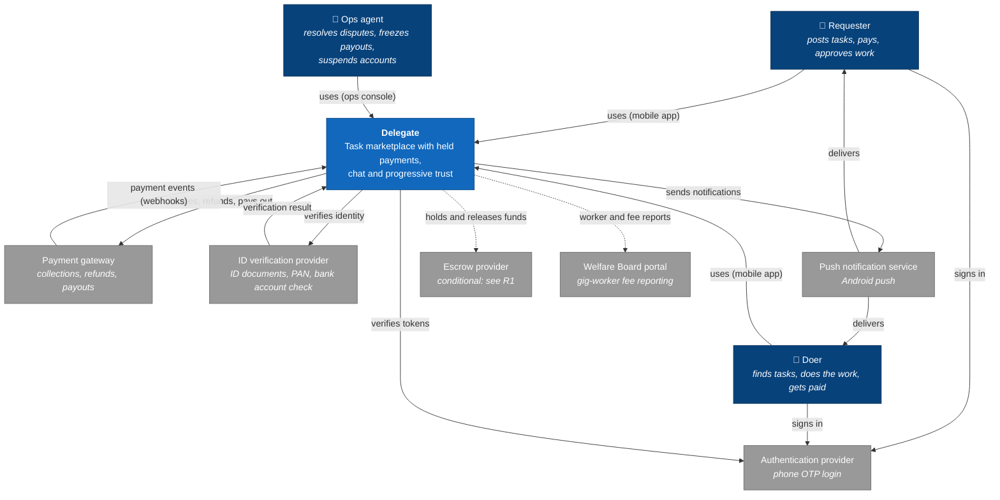

# 02 · System context (C4 level 1)

**Status:** Draft 1. Source: [01-requirements-and-drivers.md](01-requirements-and-drivers.md).

> **How.** A context diagram shows Delegate as **one box** and everything around it: the people
> who use it and the external systems it depends on. Nothing inside the box is shown. The purpose
> is to fix the **boundary**: what we build and are responsible for, and what we rely on others
> for. Every arrow is a dependency, and every external system is something that can be slow, down,
> or wrong.
>
> **Inside or outside?** A service we rent and configure ourselves (a cloud database, file
> storage) is *inside* the boundary: it is part of our system, and it appears in step 3. A service
> run by another business, with its own rules and its own failures (a payment gateway, an SMS
> provider), is *outside*.

## Diagram

Dotted lines are not yet certain.

## People

| Role | Uses | What they need from Delegate |
| --- | --- | --- |
| **Requester** | Mobile app | Post a task, choose a doer, pay, chat, approve or dispute |
| **Doer** | Mobile app | See matching tasks within seconds, apply, chat, deliver, get paid within a day |
| **Ops agent** | Ops console (web) | See everything about a task, resolve disputes, freeze payouts, suspend accounts |

Requester and doer are **roles, not people**: one person can hold both ([ADR-0002](adr/0002-one-mobile-app-for-both-roles.md)).
A diagram shows roles because each role has different permissions and different needs.

## External systems

| System | What flows out | What flows in | Why it is outside | If it fails |
| --- | --- | --- | --- | --- |
| **Payment gateway** | Charge requests, refunds, payout instructions | Payment and payout events via webhooks, reconciliation reports | Regulated money handling ([ADR-0001](adr/0001-use-a-payment-gateway.md)) | Money actions pause; everything else keeps working (fail closed) |
| **Authentication provider** | Token checks | Signed login tokens | Phone OTP login and SMS abuse protection ([ADR-0006](adr/0006-managed-authentication.md)); SMS delivery in India needs sender and template registration | Nobody new can log in. Existing sessions keep working |
| **ID verification provider** | ID documents, PAN, bank details for checking | Verified or rejected, with reasons | Access to government ID sources we cannot reach directly | Doers wait in a "pending" state; nothing else is affected |
| **Push notification service** | Notifications addressed to devices | Delivery failures, expired device tokens | Android push delivery is controlled by the platform | Doers miss tasks until they open the app; attribute 4 degrades |
| **Escrow provider** *(conditional)* | Instructions to hold, release or refund | Confirmation events | Only needed if the lawyer rules that we cannot hold funds via the gateway (risk R1) | Same as the gateway: money actions pause |
| **Welfare Board portal** *(conditional)* | Worker records and fee remittance reports | Acknowledgements | A government system | Reports are late; likely manual at first, uploaded by ops |

**Deliberately left off:** app stores (distribution, not runtime), error tracking and analytics
(tooling for us, not part of what the system does), and cloud file storage and databases (inside
the boundary, shown in step 3).

## Decisions and questions this diagram raises

| Item | Kind | Notes |
| --- | --- | --- |
| Login: build our own phone-OTP flow, or use a managed provider? | Decided | Managed provider, vendor to be chosen: [ADR-0006](adr/0006-managed-authentication.md) |
| Is there a maps or location service? | Depends on "one physical errand type?" (drivers doc, open decisions) | Only needed if physical errands are in scope |
| Does anything check task content automatically (the founder's "could AI check tasks?")? | Decision, step 5 | If yes, it is another external system: an AI or moderation API |
| Is the Welfare Board reporting automated or manual? | Question for founder | Manual (ops uploads a report) is enough at launch |
| Do we send email or WhatsApp messages at all? | Question for founder | Already in *Still unasked*; each one is another external system |
