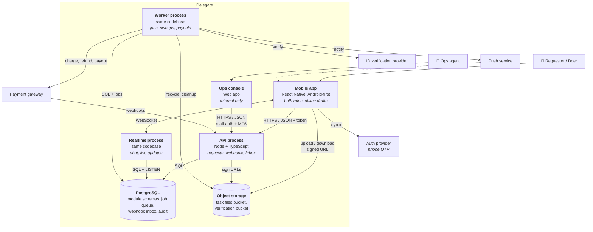

# 03 · Containers (C4 level 2)

**Status:** Draft 1. Sources: [02-context.md](02-context.md), ADRs
[0003](adr/0003-modular-monolith.md)–[0006](adr/0006-managed-authentication.md).

> **How.** A container is anything that **runs separately or stores data**: an app, a server
> process, a database, a file store. (It has nothing to do with Docker.) This step opens the
> Delegate box from step 2 and shows what is inside and how the pieces talk. For each container,
> write what it does and **why it is separate**; for each arrow, write the protocol. A container
> that cannot say why it is separate should be merged into another one.

## Diagram

Escrow provider and Welfare Board portal (conditional in step 2) are left off until they are
confirmed; both would be called from the worker.

## Containers

| Container | Technology | Responsibility | Why it is separate |
| --- | --- | --- | --- |
| **Mobile app** | React Native | Both roles; offline drafts; retry-safe submits | A different runtime on the user's phone ([ADR-0002](adr/0002-one-mobile-app-for-both-roles.md)) |
| **Ops console** | Web app (React) | Disputes, freezes, suspensions, full task history | A different user, different permissions; never shipped in the public app (ADR-0002) |
| **API process** | Node + TypeScript | Every request from both clients; stores incoming webhooks in the inbox | The ordinary request path ([ADR-0003](adr/0003-modular-monolith.md)) |
| **Realtime process** | Same codebase | WebSocket connections for chat and live feed updates | An API deploy must not drop every conversation (ADR-0003) |
| **Worker process** | Same codebase | Jobs, sweeps, all outbound calls to providers, payouts, deletions | Timed work without a request; slow provider calls never block the API (ADR-0003) |
| **PostgreSQL** | Managed PostgreSQL | All module data, job queue, webhook inbox, audit history | The single source of truth ([ADR-0004](adr/0004-postgres-for-data-jobs-and-events.md)) |
| **Object storage** | S3-compatible, two private buckets | Task files and verification documents | Keeps file bytes out of the database and the API ([ADR-0005](adr/0005-object-storage-for-files.md)) |

The language follows the team's skills (constraints, 01 section 3) and lets the mobile app and
the backend share types. It is noted here rather than in its own ADR because no other option was
seriously in contention.

## Rules visible in the diagram

1. **Outbound calls to providers happen in the worker, never inside a request.** A slow or failed
   payment gateway delays a job, which retries; it never hangs a user's request or holds a
   database transaction open. The one exception is the API *receiving* webhooks, which it stores
   and acknowledges immediately.
2. **The app talks to four places**: the auth provider, the API, the realtime process and object
   storage. Only the API and realtime process ever see our data.
3. **Nothing talks to PostgreSQL except our three processes.** The ops console goes through the
   API, so ops actions pass the same rules and the same audit as user actions (ASR-7).

## Walkthrough: a task is published

This is how the design is checked against attribute 4 (a new task on matching doers' phones
within 10 seconds).

| Step | Container | What happens | Time budget |
| --- | --- | --- | --- |
| 1 | App → API | Requester submits the task, with an idempotency key so a retry cannot post it twice | 0.5 s |
| 2 | API → DB | **One transaction**: insert the task, insert a `notify-matching-doers` job, `NOTIFY task_published` | 0.1 s |
| 3 | DB → Realtime | Realtime hears the signal and pushes the task to doers who are online and match | 0.5 s |
| 4 | DB → Worker | Worker picks up the job | up to 1–2 s |
| 5 | Worker → DB | Matching query finds the doers to notify | 0.5 s |
| 6 | Worker → Push | Sends notifications | 1–3 s |
| | | **Total for offline doers** | **about 4–7 s** |

Online doers see the task at step 3, in about a second. Offline doers get a push within the
budget with a few seconds to spare. Steps 4 and 6 are the ones to measure first.

If step 2 fails, nothing happens at all, which is correct: no task, no job, no signal.

## Open for later steps

| Item | Step |
| --- | --- |
| Module boundaries inside the codebase, and which module owns which tables | 4 |
| The money lifecycle, ledger and reconciliation | 5 |
| How matching works, and what "matching doer" means | 5 |
| Hosting, networking, the load balancer in front of API and realtime, environments | Decided: [ADR-0007](adr/0007-hosting-on-managed-containers.md), [06](06-operations.md) |
| Staff authentication for the ops console (a provider, or company single sign-on) | 6 |
| Authentication vendor ([ADR-0006](adr/0006-managed-authentication.md) criteria) | Before sprint 1 |
