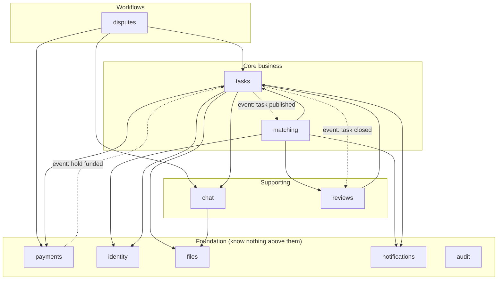

# 04 · Modules

**Status:** Accepted (2026-09-28). Sources: [03-containers.md](03-containers.md),
[ADR-0003](adr/0003-modular-monolith.md).

> **How.** A module is **a unit of behaviour that owns its data and enforces its rules**. It is not
> a table. "Task has a requester, a doer, a payment, a chat" describes data; it does not say who is
> allowed to change what, or which rules must hold. Three tests find the boundaries:
>
> 1. **Rules that must hold together belong together.** If two pieces of data must always change
>    in the same step to stay correct, they belong to one module.
> 2. **Things that change for different reasons belong apart.** Payment rules change when the
>    lawyer or the gateway says so; task rules change when the founder does. Different reasons,
>    different modules.
> 3. **The same word meaning different things marks a boundary.** A "user" is a login to
>    identity, a set of skills to matching, and a bank account to payments.
>
> Then arrange the modules so that **dependencies point one way**: from business workflows down to
> general-purpose building blocks. Stable, generic modules sit at the bottom and know nothing about
> the modules above them.

## Module map



Solid arrows are **calls**, and they only point **down**. Dotted arrows are **events**, which let a
lower module announce something without knowing who listens. `audit` is called by every module
and is left off the diagram to keep it readable.

## The two rules that keep it clean

**1. Calls go down, events go up.** When a lower module needs to tell a higher one something, it
emits an event instead of calling it. Payments never calls tasks; it emits "hold funded", and tasks
reacts. Events travel through the job queue in the same transaction as the change that caused them
([ADR-0004](adr/0004-postgres-for-data-jobs-and-events.md)), so an event can never be lost or sent
for a change that rolled back.

**2. Foundation modules take opaque references, not business objects.** Payments holds money
"for reference `task:42`". It does not know what a task is, what states it has or who a doer is.
Files stores objects; it does not know about messages. This is what lets a foundation module be
reused for retainers, subscriptions or staged payments in year 2 without changing it.

## Modules

### Foundation

| Module | Owns (only it may write) | Offers | Emits | Depends on |
| --- | --- | --- | --- | --- |
| **identity** | Users (our user ID ↔ auth provider ID), profiles, verification tier, suspension state, device tokens | `getUser`, `getTrustTier`, `startVerification`, `suspend` | `user.verified`, `user.suspended` | Auth and ID verification providers |
| **payments** | Holds, ledger entries, payouts, refunds, webhook inbox, payout accounts | `createHold`, `release`, `refund`, `split`, `freeze` | `hold.funded`, `hold.failed`, `payout.completed` | Payment gateway |
| **files** | File records and objects in both buckets | `requestUpload`, `confirmUpload`, `getDownloadUrl`, `scheduleDeletion` | none | Object storage |
| **notifications** | Notification log, preferences | `send(userId, template, data)` | none | Push service |
| **audit** | The append-only audit log | `record(actor, action, subject, reason)` | none | none |

### Supporting

| Module | Owns | Offers | Emits | Depends on |
| --- | --- | --- | --- | --- |
| **chat** | Conversations, participants, messages, read receipts | `openConversation`, `postMessage`, `lock`, `getTranscript` | `message.posted` | files |
| **reviews** | Ratings, reviews, publication state, per-user rating summaries | `submitReview`, `getSummary` | `review.published` | tasks (to check the task closed and the reviewer took part) |

### Core business

| Module | Owns | Offers | Emits | Depends on |
| --- | --- | --- | --- | --- |
| **tasks** | Tasks and their state machine, applications and bids, deliverables, deadlines, categories | `publish`, `apply`, `acceptApplication`, `submitDeliverable`, `approve`, `requestRevision`, `cancel`, plus a read-only view of open tasks | `task.published`, `task.matched`, `task.closed` | payments, chat, identity, files, notifications |
| **matching** | Doer skills and availability, feed ranking | `getFeed(doerId, filters)`, `findDoersFor(taskId)` | none | tasks (read-only view), identity, reviews, notifications |

### Workflows

| Module | Owns | Offers | Emits | Depends on |
| --- | --- | --- | --- | --- |
| **disputes** | Dispute cases, statements, decisions | `raise`, `addStatement`, `decide` | `dispute.decided` | tasks, payments, chat |

### What is not a module

- **Ops.** The ops console calls the same module interfaces as the app, with a staff identity and
  a reason on every action. There is no separate "admin" path to the data, so ops actions obey the
  same rules and are audited the same way (ASR-7).
- **Authentication.** It happens at the edge: the API verifies the provider's token and turns it
  into our user ID before any module is called ([ADR-0006](adr/0006-managed-authentication.md)).

## Where the rules live

Each rule lives in the module that owns the action, not in the module that owns the data it
reads.

| Rule | Lives in | Why not elsewhere |
| --- | --- | --- |
| "Accepting an insurance task needs trust tier 2" | tasks | Identity knows the tier; only tasks knows which categories are sensitive |
| "No phone numbers or OTPs in messages" | chat | It applies to every message, whatever the conversation is about |
| "Reviews are published when both sides rate, or after 7 days" | reviews | Nothing else cares |
| "Never pay out a frozen hold" | payments | It must hold whichever module asks for the payout |

## Walkthrough: a requester accepts a doer and pays

| Step | Where | What happens |
| --- | --- | --- |
| 1 | API → **tasks** | `acceptApplication(task 42, application 7)`. In **one transaction**: the application is accepted, the task moves to *awaiting payment*, and tasks calls `payments.createHold(reference "task:42", payer, payee, amount)`. Tasks stores the hold ID |
| 2 | App → gateway | The requester completes the payment in the gateway's checkout |
| 3 | Gateway → API → **payments** | The webhook lands in the payments inbox. The worker processes it: the hold becomes *funded*, and `hold.funded {reference: "task:42"}` is queued **in the same transaction** |
| 4 | Worker → **tasks** | Tasks handles `hold.funded`: task 42 moves to *in progress*, it calls `chat.openConversation` and `notifications.send(doer, "you're hired")` |

At no point does payments know what a task is. If the requester never pays, a sweep in tasks finds
tasks stuck *awaiting payment* past a deadline and reopens them; payments only ever sees a hold
that was never funded.

This works across modules in one transaction because they share one database
([ADR-0003](adr/0003-modular-monolith.md)): module operations accept the caller's transaction.

## Enforcing it in code

```text
src/modules/
  tasks/
    index.ts        ← the only file other modules may import
    events.ts       ← the events tasks emits, with their payload types
    internal/       ← everything else; private to the module
  payments/
    index.ts
    ...
```

- Each module's tables live in its own PostgreSQL schema (`tasks.task`, `payments.hold`). Other
  modules read through the module's functions or a **published read-only view**, never its tables.
- A dependency lint rule in CI fails the build if a module imports another module's `internal/`,
  or if an import points **up** the map.

## Decided questions

| Question | Decision | Why |
| --- | --- | --- |
| Is `disputes` its own module, or part of `tasks`? | Its own module | A dispute freezes money, changes task state and reads the chat. As a workflow on top, it coordinates those three without teaching any of them about disputes |
| Does matching read tasks through a function or a published view? | A published read-only view | The feed query needs to filter and sort open tasks efficiently; a view keeps that in SQL without exposing the tables |
| Where does verification (the ID provider flow) live? | Inside `identity` for now | It produces the trust tier identity owns. Split it out if it grows |
