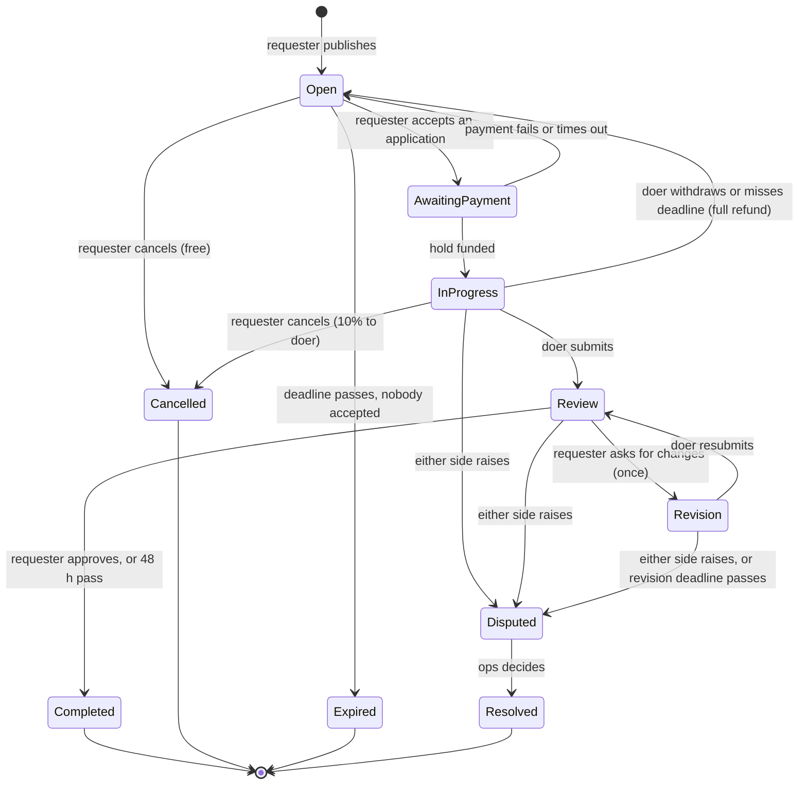

# 05a · The task lifecycle

**Status:** Draft 1. Owner module: `tasks` ([04-modules.md](04-modules.md)). Sources: the
founder's lifecycle answer in [00-discovery.md](00-discovery.md); ASR-1 and ASR-2 in
[01-requirements-and-drivers.md](01-requirements-and-drivers.md).

> **How.** The lifecycle is an **explicit state machine**: a fixed list of states and a table of
> allowed transitions. Anything not in the table cannot happen. Each transition names its
> **trigger** (an actor, a timer or an external event), its **guard** (what must be true) and its
> **effects** (calls into other modules, events emitted). Design it in this order: states, then
> transitions, then a deadline for every waiting state, then the races. Finish by writing the
> **invariants**, the sentences that must be true of every task at every moment, because those
> become the tests.

## Scope: task state, not money state

This machine tracks **what is happening to the work**. Whether money has actually moved is tracked
by payments, in its own machine ([05b](05b-money.md)). The task tells payments what should happen
(`createHold`, `release`, `refund`, `split`, `freeze`); payments reports what did.

Keeping them apart is deliberate. A task can be *Completed* while its payout is still retrying
after a bank failure, and a dispute can end in a partial refund *and* a partial payout. Merged into
one machine, those produce states like "completed but payout failed and partly refunded".

Drafts live on the requester's phone until they are published (NFR: drafts survive a crash), so
the server's lifecycle starts at *Open*.

## States



| State | Meaning | Money (per payments) |
| --- | --- | --- |
| **Open** | Published; doers can apply | Nothing held |
| **AwaitingPayment** | A doer is chosen; waiting for the requester's payment to arrive | Hold created, not yet funded |
| **InProgress** | Paid; the doer is working | Held |
| **Review** | The doer has submitted; the requester decides | Held |
| **Revision** | The requester asked for changes; the doer is revising | Held |
| **Disputed** | A dispute is open; ops will decide | Held and **frozen** |
| **Completed** | *Terminal.* The work was accepted | Released to the doer |
| **Cancelled** | *Terminal.* The requester cancelled | Refunded, less any forfeit |
| **Expired** | *Terminal.* Nobody was chosen in time | Nothing was ever held |
| **Resolved** | *Terminal.* Ops decided a dispute | Released, refunded or split |

## Transitions

| # | From → to | Trigger | Guard | Effect |
| --- | --- | --- | --- | --- |
| T1 | Open → AwaitingPayment | Requester accepts an application | Requester owns the task; application active; doer's trust tier meets the category's requirement | `payments.createHold(amount)` |
| T2 | AwaitingPayment → InProgress | Event `hold.funded` | Hold belongs to this task | `chat.openConversation`; notify the doer |
| T3 | AwaitingPayment → Open | Event `hold.failed`, or payment deadline passes | none | `payments.cancelHold`; the application returns to the pool |
| T4 | Open → Cancelled | Requester cancels | none | none: nothing is held |
| T5 | Open → Expired | Task deadline passes | No application accepted | none |
| T6 | InProgress → Cancelled | Requester cancels | none | **Path 3:** `payments.split(10% to doer, 90% refund)`; lock chat |
| T7 | InProgress → Open | Doer withdraws, or task deadline passes with no submission | none | **Path 4:** `payments.refund(full)`; doer's completion rate drops; requester must confirm a new deadline |
| T8 | InProgress → Review | Doer submits | Deliverable meets the category template | Start the 48 h review clock |
| T9 | Review → Completed | Requester approves | none | **Path 1:** `payments.release`; lock chat; emit `task.closed` |
| T10 | Review → Completed | Review deadline passes (sweep) | No dispute raised before the deadline | **Path 2:** as T9 |
| T11 | Review → Revision | Requester asks for changes | No revision used yet | Start the revision clock |
| T12 | Revision → Review | Doer resubmits | Deliverable meets the template | Restart the 48 h review clock |
| T13 | InProgress, Review or Revision → Disputed | Either side raises a dispute; or the revision deadline passes | Raised before the state's deadline | `payments.freeze`; open a dispute case |
| T14 | Disputed → Resolved | Ops decides | A reason is recorded | **Path 5 or 6:** `payments.release`, `refund` or `split` as decided; lock chat |

All six money paths from ASR-1 appear: approval (T9), auto-approval (T10), cancellation with a
forfeit (T6), doer no-show (T7), dispute split (T14), full refund (T7 and T14).

**Why a doer's withdrawal reopens the task instead of ending it.** The requester still needs the
work done. Ending the task would force them to post it again from scratch; reopening refunds them
and puts the task back in front of doers.

## Deadlines

Every state where the system waits for someone has a deadline and a defined outcome. A sweep in
the worker checks each one every minute ([ADR-0004](adr/0004-postgres-for-data-jobs-and-events.md)).

| State | Waiting for | Deadline | When it passes |
| --- | --- | --- | --- |
| Open | A requester to choose | The task's deadline | T5 → Expired |
| AwaitingPayment | The requester's payment | 30 minutes after acceptance | T3 → Open |
| InProgress | The doer's submission | The task's deadline | T7 → Open, full refund |
| Review | The requester's decision | 48 hours after submission | T10 → Completed, paid |
| Revision | The doer's resubmission | To be set by the founder (draft: 48 hours) | T13 → Disputed |
| Disputed | Ops | 48-hour target | **No automatic outcome.** An alert fires; money never moves without an ops decision |

Disputed is the one state whose deadline triggers an alert instead of a transition. Money that is
contested must be moved by a person.

## Races

Two transitions can be attempted on the same task at the same moment. The app cannot stop that,
so the database decides. Every transition is a **compare-and-set**:

```sql
UPDATE tasks.task
SET    status = 'Completed', version = version + 1
WHERE  id = 42 AND status = 'Review'
```

If it updates no rows, another transition got there first. The loser rolls back its whole
transaction, including any payment call, and the user is shown what actually happened ("This task
was just submitted; review it instead").

**Race A: a dispute at 47:59:59, as the 48-hour sweep runs.** *The dispute wins.*
A priority is not a mechanism, so the rule is made about **time, not order**:
- A dispute is valid if the **server** receives it before the review deadline. The phone's clock
  does not count.
- The sweep only auto-approves tasks whose deadline passed **more than 5 minutes ago**.

Any dispute that arrived in time has long since committed by the time the sweep looks, so the
dispute wins every time, whichever process happens to run first.

**Race B: the requester cancels as the doer submits.** *First to commit wins, and that is
accepted.* Both are transitions out of InProgress, and there is no deadline to anchor a rule to.
The policy preference is for the submission (the work exists; the doer should not get only 10%
for it), but guaranteeing that would need a waiting period on every cancellation. Instead:
- If the submission commits first, the cancel fails and the requester is shown the deliverable.
  They can still dispute it.
- If the cancel commits first, the doer is told the task was cancelled and receives the 10%. If
  they had finished the work, they can raise it with ops.

The race needs two actions within about a second of each other, so it will be rare. **Not every
race needs a clever mechanism; some need a clear message and a fallback.**

## Implementation shape

Every transition goes through one function, so no code path can change a task's state without the
guard, the history row and the effects:

```ts
await tasks.transition(tx, {
  taskId: 42,
  from: ['Review'],          // compare-and-set
  to: 'Completed',
  actor: { kind: 'system', reason: 'review-deadline' },
  guard: (task) => task.reviewDeadline < now() - GRACE,
  effects: (task) => [
    payments.release(tx, task.holdId),
    chat.lock(tx, task.conversationId),
    emit(tx, 'task.closed', { taskId: 42 }),
  ],
});
```

It writes a row to `tasks.task_transition` (from, to, actor, reason, time) in the same
transaction. That table is the task's full history for the ops console, and part of the audit
trail.

## Invariants

These must be true of every task at every moment. Each becomes an automated test.

1. A task in InProgress, Review, Revision or Disputed has exactly one **funded** hold.
2. A task has at most one accepted application.
3. A terminal state is never left.
4. Money moves out of a Disputed task only through T14, which requires an ops decision.
5. A task uses at most one revision.
6. Every state change has a matching row in `task_transition`.

## Questions for the founder

| Question | Draft answer |
| --- | --- |
| How long does the doer have to deliver a revision? | 48 hours |
| Can a doer raise a dispute, or only the requester? | Either side, from InProgress onwards |
| Does the 10% forfeit apply if the doer has not started? | Yes, as the founder stated; revisit if it causes complaints |
| After a doer no-show, how long does the requester have to set a new deadline? | 24 hours, then the task expires with the refund already made |
| Can the requester cancel during Review? | No: they approve, ask for a revision or dispute |
