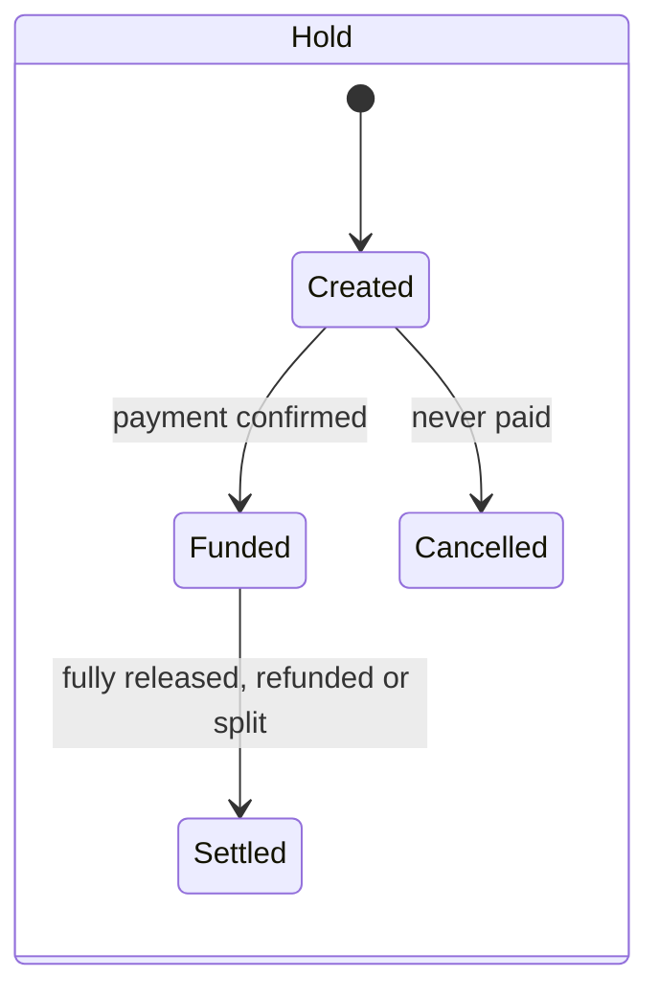
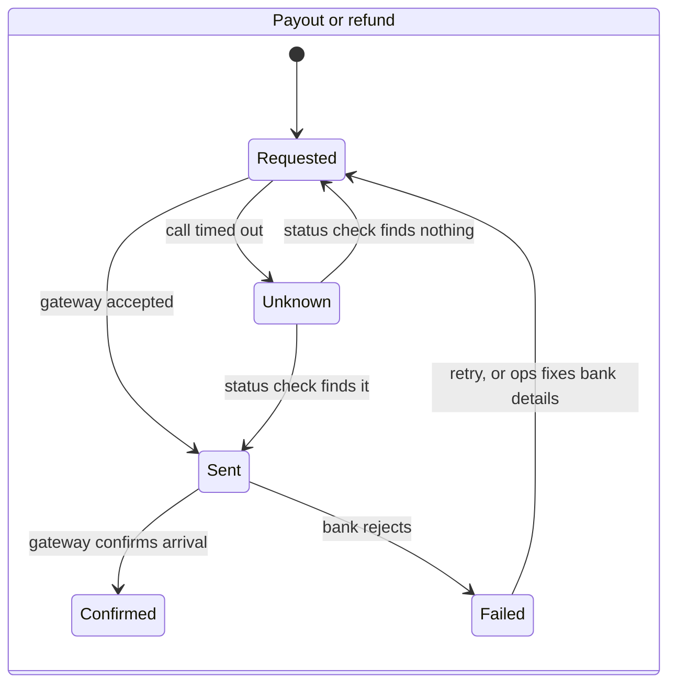

# 05b · Money

**Status:** Draft 1. Owner module: `payments` ([04-modules.md](04-modules.md)). Sources:
attribute 1 (financial correctness) and ASR-1 in
[01-requirements-and-drivers.md](01-requirements-and-drivers.md);
[ADR-0001](adr/0001-use-a-payment-gateway.md); [05a](05a-task-lifecycle.md).

> **How.** Money design answers three questions, in this order:
> 1. **Where is every paisa right now, and why?** A double-entry ledger.
> 2. **How does each movement happen exactly once?** State machines for holds, payouts and
>    refunds, plus idempotency at every entry point.
> 3. **How do we prove our records match reality?** Reconciliation against the gateway.
>
> The first is bookkeeping, the second is distributed-systems engineering, and the third is
> operations. All three are needed; any one alone fails.

## Why not a payments table with amount columns

The first instinct is one row per payment, with columns for amount paid, refunded, doer share and
fee, plus a log of transactions. The log is the right instinct. The columns are what break:

| What happens | What the columns do |
| --- | --- |
| A dispute gives a partial refund, then ops adds a goodwill refund | The second overwrites the first, or needs a `refund_2` column |
| A payout fails at the bank and is retried | `doer_share` says ₹42.50 either way; nothing says whether it was paid |
| A bug writes the refund twice | The old value is gone; there is nothing to compare against |
| "How much do we owe doer D across all tasks right now?" | A query across every row, filtered by statuses that may themselves be wrong |
| Does paid = refund + doer share + fee? | Nothing forces it; a mismatch is found only if someone looks |

Columns store **the current answer**. Money needs **the history that produced it**, in a form
where the totals cannot fail to add up.

## 1. The ledger

A ledger records money as **transfers between accounts**. Every transfer takes an amount from
one account and adds it to another, so the sum across all accounts is always zero, by
construction. Balances are never stored as the truth; they are **computed from the transfers**.

### Rules

1. **Append-only.** A transfer is never updated or deleted. A mistake is corrected by a new,
   reversing transfer, so the mistake and its correction both stay visible.
2. **Every transfer has a cause**: the task, the transition that caused it (T6, T14…), and an
   idempotency key.
3. **Integers in paise.** Never floating point. Every percentage has a written rounding rule, and
   any remainder goes to a named account, never into thin air.
4. **External movements are recorded when confirmed, not when requested.** Money leaving to a bank
   is posted when the gateway says it arrived, not when we asked for it.

### Accounts

| Account | Holds | Returns to zero when |
| --- | --- | --- |
| `external:payer` | Money that came in from requesters (a mirror of the outside world) | Never; it only grows |
| `external:bank` | Money that left to doers' and requesters' banks | Never |
| `external:gateway_fees` | What the gateway charged us | Never |
| `hold:<reference>` | Money held for one task | The task reaches a terminal state |
| `payable:doer:<id>` | Owed to a doer, not yet paid out | The payout is confirmed |
| `refundable:requester:<id>` | Owed back to a requester, not yet refunded | The refund is confirmed |
| `platform:revenue` | Platform fees earned, less costs the platform bears | Never; this is the business |
| `liability:welfare_fee` | Karnataka welfare fee collected, not yet remitted | Each quarterly remittance |

### Worked example: a ₹500 task, cancelled while in progress

Assumptions for the example (fee structure is still undecided): platform fee is 15% of what the
doer receives; the gateway charges 2%; the platform bears the gateway fee and the welfare fee (1%
of payout), which is a question for the CA.

| # | Cause | From → to | Amount |
| --- | --- | --- | --- |
| 1 | T2: payment confirmed | `external:payer` → `hold:task:42` | ₹500.00 |
| 2 | Gateway fee on the payment | `platform:revenue` → `external:gateway_fees` | ₹10.00 |
| 3 | T6: cancellation, doer's 10% | `hold:task:42` → `payable:doer:D` | ₹50.00 |
| 4 | T6: cancellation, requester's 90% | `hold:task:42` → `refundable:requester:R` | ₹450.00 |
| 5 | Platform fee on the doer's share | `payable:doer:D` → `platform:revenue` | ₹7.50 |
| 6 | Welfare fee, 1% of ₹42.50 = 42.5 paise, rounded up | `platform:revenue` → `liability:welfare_fee` | ₹0.43 |
| 7 | Payout confirmed by the gateway | `payable:doer:D` → `external:bank` | ₹42.50 |
| 8 | Refund confirmed by the gateway | `refundable:requester:R` → `external:bank` | ₹450.00 |

**What the ledger proves afterwards**

- `hold:task:42` = 500 − 50 − 450 = **0**. A terminal task holds nothing.
- `payable:doer:D` = 50 − 7.50 − 42.50 = **0**. The doer was paid in full.
- `refundable:requester:R` = 450 − 450 = **0**. The requester was refunded in full.
- `platform:revenue` = −10 + 7.50 − 0.43 = **−₹2.93**. **The platform lost money on this task.**

That last line is a business finding, not a technical one: under these assumptions every
mid-task cancellation of a ₹500 task costs the platform about ₹3. The ledger makes unit economics
visible task by task. Worth showing the founder.

### Schema sketch

```sql
CREATE TABLE payments.account (
  id        text PRIMARY KEY,           -- 'hold:task:42', 'payable:doer:D'
  kind      text NOT NULL,
  opened_at timestamptz NOT NULL DEFAULT now()
);

CREATE TABLE payments.journal (
  id              bigserial PRIMARY KEY,
  idempotency_key text NOT NULL UNIQUE, -- 'task:42:T6:split'
  cause           text NOT NULL,        -- 'task:42 T6 requester cancelled'
  created_at      timestamptz NOT NULL DEFAULT now()
);

CREATE TABLE payments.transfer (
  id             bigserial PRIMARY KEY,
  journal_id     bigint NOT NULL REFERENCES payments.journal(id),
  from_account   text   NOT NULL REFERENCES payments.account(id),
  to_account     text   NOT NULL REFERENCES payments.account(id),
  amount_paise   bigint NOT NULL CHECK (amount_paise > 0)
);
-- No UPDATE or DELETE is granted on journal or transfer to the application's database role.
```

A journal groups the transfers of one business event (rows 3–5 above are one journal: the
cancellation). The `UNIQUE` idempotency key means **the same event cannot be posted twice**, even if
the code tries.

## 2. Exactly once

"Exactly once" is not something a network can deliver. What can be built is **at-least-once
delivery plus idempotent effects**: every step may happen more than once, and repeating it
changes nothing.

### Where duplicates come from, and the defence for each

| Source | Example | Defence |
| --- | --- | --- |
| The app retries | Requester taps "Pay" twice on patchy 4G | An idempotency key on every money request from the app; the API returns the first result for a repeated key |
| The gateway repeats a webhook | "Payment captured" arrives twice | The webhook inbox ([ADR-0004](adr/0004-postgres-for-data-jobs-and-events.md)) stores the gateway's event ID uniquely; the duplicate is dropped |
| A job runs twice | The worker crashes after posting, before marking the job done | Every posting uses a deterministic idempotency key; the second attempt hits the `UNIQUE` constraint and does nothing |
| **A call to the gateway times out** | A payout request gets no response | **Never retry a money call blindly.** Ask the gateway for the status of our reference first; send again only if it confirms nothing happened. Always send our own reference so the gateway can deduplicate too |

The last row is the one that causes real double payouts. A timeout means *unknown*, not *failed*.

### State machines for movements

Each external movement has its own small machine. The ledger records the confirmed result; these
record the attempt.





- **Freezing is not a state; it is a flag** on the hold (and on a doer's payouts) with a reason.
  Any state can be frozen, and nothing moves out of a frozen hold or to a frozen doer. This is how
  ops's "freeze immediately" works (attribute 5): it stops the next movement wherever the money is.
- **Unknown is a real state.** It is where the system fails closed: an Unknown payout is never sent
  again until the status check resolves it.
- Payouts are batched by the worker, which lets the 24-hour payout promise be met with one run a
  few times a day.

## 3. Reconciliation

Our ledger says what we believe happened. The gateway's records say what did
([ADR-0001](adr/0001-use-a-payment-gateway.md)). Reconciliation compares them.

**Daily, against the gateway's settlement report:**

| Bucket | Meaning | Action |
| --- | --- | --- |
| Matched | A gateway transaction and a ledger transfer agree on reference and amount | None |
| In the gateway, not in our ledger | Money moved that we did not record (a missed webhook) | Alert; post it through the normal path once understood |
| In our ledger, not in the gateway | We recorded money that did not move | Alert; **pause payouts** until explained |
| Amounts differ | Fees or partial captures we modelled wrongly | Alert |

**Also daily, internal checks:**

- Every hold for a task in a terminal state has a balance of zero.
- No `payable` or `refundable` account is negative.
- No payout has been in Unknown or Sent for more than a day.

The target in attribute 1 is **zero unexplained differences**. Any difference older than a day
pauses payouts: the system fails closed.

## 4. Fee policy

Pricing will change many times before it settles, so no fee is a constant in code.

**Draft commercial position** (for the founder to decide; tax and legal points need the CA and
lawyer):

| | Requester | Doer |
| --- | --- | --- |
| Platform fee | Small or zero at launch, included in one all-in displayed price | The main take rate, about 12–15% |
| Gateway fee on collection | Absorbed into the requester's all-in price, not itemised | none |
| Payout cost | none | Absorbed by the platform, or a small fee only for optional instant payouts |
| Welfare fee | none | **Borne by the platform**, not deducted; likely a legal requirement (lawyer to confirm) |

Supporting positions: the first task for each requester is fee-free (a promotion); tasks below a
minimum value either cannot be posted or carry a small flat fee; the doer's fee falls as a
requester–doer pair's billing grows, to make staying on the platform cheaper than leaving (risk
R6). Actual gateway pricing must be checked per payment method, since UPI is often far cheaper
than cards.

**Design rules**

1. **Fee rules are versioned data**, keyed by side, category, price band and the requester–doer
   relationship. Changing a rule creates a new version; old versions are never edited.
2. **Every task stores a snapshot** of the fee rule version that applied when it was accepted.
   A price change never alters the terms of a task already under way.
3. **Promotions are paid from their own account**, `platform:promotions`, so a waived fee shows
   as a cost and never as reduced revenue.
4. **Rules can target a cohort** of users, so the founder can compare, say, 12% against 15% on
   real behaviour.
5. **Contribution margin per task is a standard report**, grouped by category and price band,
   computed from the ledger.

## Where the legal question (risk R1) fits

The design above does not depend on who legally holds the money. If the lawyer requires an escrow
provider, `hold:*` accounts mirror money held by that provider instead of the gateway, and the
provider's reports join the reconciliation. The ledger, the state machines and the idempotency
rules stay the same. This is the containment promised in risk R1.

## Invariants

1. The sum of all account balances is zero (guaranteed by construction).
2. A hold for a task in a terminal state has zero balance.
3. No transfer is ever updated or deleted.
4. Each business event is posted at most once (the unique idempotency key).
5. No money leaves a frozen hold or goes to a frozen doer.
6. A payout in Unknown is never sent again until its status is resolved.

## Questions for the founder and the CA

| Question | Why it matters |
| --- | --- |
| Who pays the platform fee, and is it charged on the doer's share after a cancellation? | Changes rows 5 and the platform's result in the example |
| Who bears the gateway fee on a refunded payment? | In the example the platform loses ₹10 on every cancelled ₹500 task |
| Who bears the welfare fee: the platform, or deducted from the doer? | Changes row 6 |
| Is GST due on the fee, or on the whole task value? | Could change which accounts exist |
| What does the gateway charge per method (UPI, cards, net banking), and for payouts? | Decides whether small tasks can carry the gateway cost at all |
| Does the founder accept the draft fee position in section 4? | Sets the first fee rule version |
| Minimum task value: a hard floor, or a small flat fee below a threshold? | Protects margin on ₹100 tasks |
| Is a first-task promotion affordable, and for how long? | Sizes the promotions budget |
