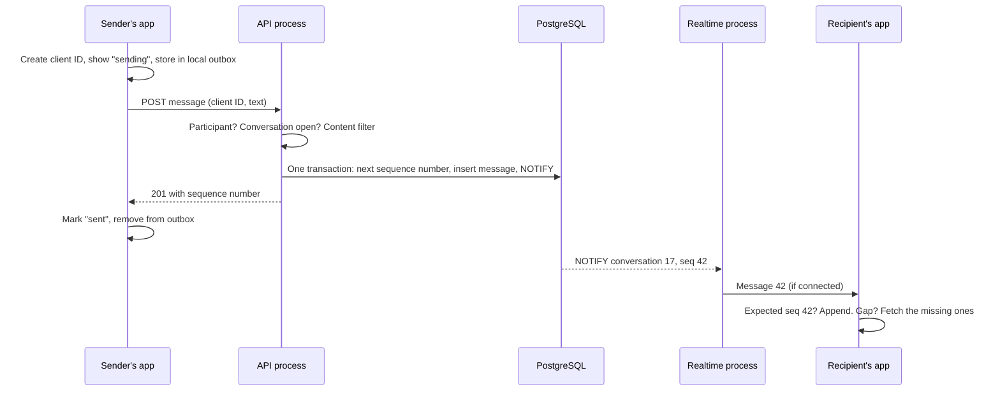

# 05d · Realtime: chat and live updates

**Status:** Draft 1. Owner module: `chat`, delivered by the realtime process
([03-containers.md](03-containers.md)). Sources: attribute 4 (a chat message arrives within 1
second), ASR-4 and ASR-8 in [01-requirements-and-drivers.md](01-requirements-and-drivers.md);
[ADR-0003](adr/0003-modular-monolith.md), [ADR-0004](adr/0004-postgres-for-data-jobs-and-events.md).

> **How.** Realtime design on mobile networks starts from one assumption: **the connection will
> drop, often, at the worst moment.** A phone on patchy 4G goes through tunnels, switches towers,
> and has its background connections killed by Android. So the design question is never "how do we
> keep the socket alive?" but **"what happens to every message when it isn't?"**
>
> The answer that makes everything else simple: **the database is the truth; the socket is only a
> doorbell.** Nothing exists only in a socket. If a doorbell ring is missed, the app asks the
> database what it missed, and nothing is lost.

## Scope

| Kind | Examples | Latency target |
| --- | --- | --- |
| **Chat** | Text, photos, documents, read receipts, per task | Under 1 second when both are online |
| **Live updates** | "Your task was accepted", "new applicant", "3 new tasks" banner, task state changes | A few seconds |

Load, from step 1: 200,000 messages a day (about 2 a second on average, 20 at peak), and about
3,000 connections at peak. One realtime process handles this with a wide margin.

## Decision: writes go through the API; the realtime process only delivers

| | A. Send messages over the WebSocket | B. Send over HTTPS to the API; the socket only delivers |
| --- | --- | --- |
| Validation, rate limits, content filter | Rebuilt in the realtime process | Already in the API |
| Retry on a flaky network | Needs its own acknowledgement protocol | An ordinary request with an idempotency key |
| Realtime process | Holds business logic; a bug there loses messages | Stateless; restarting it loses nothing |
| Latency | Slightly lower | One HTTPS request, well inside 1 second |

**Option B.** Every write, from a chat message to a read receipt, takes the same path as every
other write. The realtime process holds no data and makes no decisions; it can be restarted,
deployed or crash at any time without losing anything. That was the reason it is a separate
process in the first place ([ADR-0003](adr/0003-modular-monolith.md)).

## Sending and receiving a message



**1. The sender's app stores the message first.** It creates a unique client ID, shows the message
as "sending", and keeps it in a local outbox. If the network drops, the outbox resends it later
with the **same client ID**.

**2. The API assigns order, not the phone.** In one transaction it increments the conversation's
sequence number, inserts the message with that number, and sends a `NOTIFY`:

```sql
UPDATE chat.conversation SET last_seq = last_seq + 1
WHERE id = 17 AND locked_at IS NULL
RETURNING last_seq;                       -- 42

INSERT INTO chat.message (conversation_id, seq, client_id, sender_id, body)
VALUES (17, 42, 'c-8f2…', 'user-5', '…');
-- UNIQUE (conversation_id, client_id): a resend of the same message is rejected and
-- the API returns the original seq instead.
```

Phone clocks are wrong often enough that ordering by them would shuffle conversations. The
sequence number comes from the database, so every participant sees the same order. And because
the increment and the insert share a transaction, a failed insert leaves **no gap**.

**3. The realtime process rings the doorbell.** It listens for `NOTIFY`, and sends the new message
to any participant who is connected. For chat, the message itself travels in the frame, to save a
round trip. For every other live update, the frame only says "task 42 changed", and the app fetches
the new state from the API. Authorisation then happens in one place, the API.

**4. The recipient's app checks the sequence.** If it expected 42 and got 42, it appends. If it got
44, it fetches everything after 42. If it got 42 twice, it ignores the second. Duplicates and gaps
are both harmless.

**5. Offline recipients get a push notification.** A job checks, about 10 seconds after a message,
whether the recipient has read up to it. If not, and they are not connected, the worker sends one
push per conversation, not one per message.

## Reconnecting

Every reconnection is the same routine:

1. Connect with a fresh token. The realtime process looks up which conversations and which user
   channel this person may receive. **It never trusts a list sent by the app.**
2. For each active conversation, fetch messages after the last sequence number the app holds.
3. Send anything still in the local outbox.

Three details matter at scale:

- **Heartbeats** every 25–30 seconds. Mobile networks leave dead connections open for minutes;
  a missed heartbeat closes them.
- **Backoff with jitter.** When the realtime process restarts for a deploy, 3,000 phones reconnect.
  If they all retry on the same schedule, they arrive together, again and again. Each app waits a
  random, growing delay.
- **Foreground only.** Android kills background connections to save battery. The app holds a socket
  only while it is open; in the background, push notifications take over.

## Read receipts

Stored as **one number per participant**: `last_read_seq`. Reading up to message 42 is a single
update, not 42 rows. The app sends it after a short pause, not on every scroll.

## The content filter (ASR-4)

Runs in the API before a message is stored, as part of the `chat` module
([04-modules.md](04-modules.md), "Where the rules live"). The same function checks task
descriptions and application pitches.

| Pattern | Where | Action |
| --- | --- | --- |
| OTPs, UPI PINs, passwords, CVVs | Everywhere | Blocked; both people warned |
| Card numbers (13–19 digits passing a Luhn check) | Everywhere | Blocked |
| Phone numbers, emails, UPI IDs | Before a doer is hired (descriptions, pitches) | Blocked |

**Blocked, not silently dropped.** The sender sees why ("For your safety, OTPs can't be shared on
Delegate"), and can rephrase. Every block is counted per user; a pattern of attempts is an ops
signal.

**Filters are imperfect, and that is accepted.** Numbers written as words ("nine eight four…") are
normalised before checking, but a determined user can get around any pattern, and an OTP inside
a screenshot cannot be read at all. The filter stops accidents and casual attempts; the report
button and ops catch the rest. This is a layered defence, not a guarantee.

## Attachments

Uploaded directly to storage through the `files` module
([ADR-0005](adr/0005-object-storage-for-files.md)) **before** the message is sent. The message
refers to a confirmed file ID. Images are compressed on the phone, which also creates the
thumbnail. Downloads use short-lived signed URLs, checked against conversation membership.

## Locking and keeping messages

- When a task reaches a terminal state, tasks calls `chat.lock` ([05a](05a-task-lifecycle.md)).
  The API rejects new messages, and a live update tells both apps.
- **Users cannot permanently delete messages.** A message may be the evidence in a dispute, so
  "delete" hides it from the other person but keeps it for ops. How long transcripts are kept is
  the open retention question.

## Failure modes

| What fails | What users notice | Why nothing is lost |
| --- | --- | --- |
| The sender loses signal mid-send | "Sending…" until reconnected | The outbox resends with the same client ID |
| A `NOTIFY` is missed | The message appears on the next sync | The message is in the database |
| The realtime process restarts | A brief reconnect | All state is in the database; reconnect syncs by sequence |
| The realtime process is down | Messages still send; they arrive by push or on refresh | Writes never depended on it |
| A message is delivered twice | Nothing | The app drops a sequence number it already has |

## If it grows

- **More connections than one process holds:** run more realtime processes. Each one listens to
  the same `NOTIFY` channel and delivers only to its own connections. No coordination needed.
- **A managed realtime service** (a hosted WebSocket provider) is worth reconsidering if
  connection handling becomes an operational burden. At 3,000 connections it is not, and it would
  put message contents in another company's systems.

## Invariants

1. Every message has a sequence number unique within its conversation, with no gaps.
2. A client ID is stored at most once per conversation.
3. No message is stored in a locked conversation.
4. Blocked content is never stored or delivered.
5. A user receives realtime events only for conversations and tasks they are part of.

## Questions for the founder

| Question | Draft answer |
| --- | --- |
| After hiring, may people exchange phone numbers? | Yes, as stated; leakage is fought with fees ([05b](05b-money.md), section 4) |
| Voice notes? | Not at launch: larger files, and the credential filter cannot read them |
| Can messages be edited? | No: they may be dispute evidence |
| How long are transcripts kept after a task closes? | Open retention question ([00](00-discovery.md)) |
