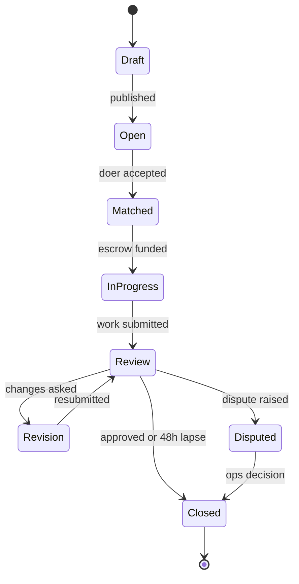
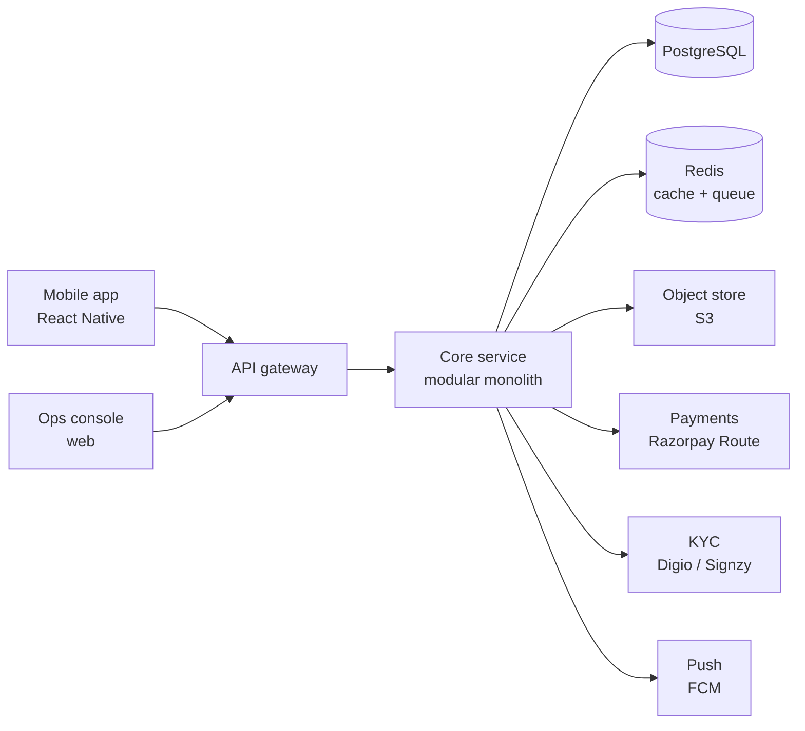

# Delegate — Product Requirements & Build Plan

2026-09-17 · Owner: @owner · Status: Draft v0.1

> Everyone deserves a personal assistant. People with money lack time; people with time want money. Delegate connects the two.

## Executive summary

**Read this section only if you have two minutes.** Sections 1–12 are the detail behind it.

Delegate is a marketplace for delegating tasks from 20 minutes to 6 months, priced from ₹100, across every field. MVP is one city, 8 categories, two task tiers, full escrow. Target: 300 completed tasks a week within 26 weeks.

**Three verified findings that change the design**

1. **The escrow model as originally drafted is not legal.** Under the RBI Payment Aggregator Directions 2025, settlement on a merchant's instruction is restricted to merchants with domestic turnover above ₹40 lakh, and full KYC plus a direct contract with every merchant is mandatory ([Ikigai Law](https://www.ikigailaw.com/article/639/rbi-rewrites-the-payment-aggregator-rulebook)). Individual doers earning ₹15,000 a month do not qualify. Escrow must be restructured — see section 7.
2. **A Bangalore launch sits inside a live gig-worker levy from day one.** Karnataka's welfare fee is operational: a minimum 1% of every payout, capped at ₹1.50 per transaction for professional services, with Welfare Board registration inside 45 days, a machine-readable worker database, quarterly remittance and mapping to the state PWFVS system ([Karma Management](https://karmamgmt.com/index.php/blog/karnataka-gig-workers-welfare-fee-2026-compliance-guide), [United Consultancy](https://unitedconsultancy.com/gig-workers-welfare-fee-karnataka-government-order-13-02-2026/)). The Act is under constitutional challenge and the Karnataka High Court declined to stay it in July 2026 ([Medianama](https://www.medianama.com/2026/07/223-karnataka-hc-gig-workers-act-welfare-fee/)).
3. **Aadhaar video KYC is not available off the shelf.** Private entities must apply through the relevant ministry, justify the need, and be cleared by MeitY before using Aadhaar authentication ([Khaitan & Co](https://www.khaitanco.com/thought-leadership/Aadhaar-authentication-for-private-entities)). Assume DigiLocker-based ID verification with PAN and a bank penny-drop at launch.

**The precedent worth studying**

Dunzo began as a WhatsApp errand service in Bengaluru in 2014 and became a household verb before raising over $450 million ([The Founder Nation](https://www.thefoundernation.com/dunzo-shutdown-what-went-wrong-and-why/)). Its model was built around offloading logistics from a personal schedule rather than around any product category — the same insight as this product ([Markhub](https://www.markhub24.com/post/dunzo-s-hyperlocal-delivery-and-task-model-pioneer-pivot-and-collapse-2015-2025)). It closed its consumer app in January 2025 and entered insolvency proceedings in August 2025, after abandoning the asset-light marketplace for capex-heavy quick commerce ([iTechGuides](https://www.itechguides.com/dunzo-shuts-down-what-happened-to-the-google-and-reliance-backed-startup/)). The errand model was not the thing that failed.

**Four decisions blocking Phase 1**

| Decision | Options | Why it blocks |
| --- | --- | --- |
| Payment architecture | Platform as merchant of record with vendor payouts, or third-party bank escrow | Sets legal structure and Phase 3 scope |
| Fee split | 15% doer plus 2% requester, or doer-only | Changes net margin; the welfare fee now sits on top |
| Launch city | Bangalore, with network and density but a live levy, or a state without a gig-worker Act | Compliance load differs materially |
| Minimum task value | ₹100 as the brand promise, or ₹200 to protect margin | A ₹150 task nets ₹21 before the levy |

**Where this is weak**

No primary user research exists yet. Every persona, price point and conversion assumption below is a hypothesis; Phase 0 exists to test them. Financial figures are illustrative, not sourced.

## 1. Problem and vision

Delegate sells time back to people by the hour, at prices that start at ₹100. A salaried professional loses two hours comparing Goa hotels or an afternoon on hold with an insurance TPA; a student, homemaker or between-jobs graduate has those hours free and wants income. Today there is no marketplace that clears a 20-minute, ₹100 errand.

The gap in the market:

| Platform | Fits | Misses |
| --- | --- | --- |
| Upwork / Fiverr | Skilled project work, ₹5,000+, days to weeks | Micro-errands; Indian pricing; phone-and-paperwork tasks |
| Urban Company | Physical services at your address, fixed catalogue | Anything cognitive, digital or open-ended |
| Personal EA / concierge firms | Full delegation | ₹25,000+ a month; only the affluent |
| WhatsApp friends and cousins | Free, trusted | No scale, no accountability, social debt |

Positioning: a personal assistant on tap, priced per task, covering 20 minutes to 6 months and every field from insurance paperwork to app development.

Why now: UPI makes ₹100 transfers costless, video KYC makes identity checks cheap, and India has a large pool of educated people seeking flexible earnings.

## 2. Users

Two sides, one app: every account can post and can do, but onboarding asks which side you start on.

**Requesters (demand)**

| Persona | Situation | Typical task | Willingness to pay | Churns when |
| --- | --- | --- | --- | --- |
| Rohit, 31, IT manager | 55-hour weeks, disposable income | Find the best Goa hotel; renew insurance | ₹200–1,000 per task | Output is worse than his own 30 minutes of effort |
| Priya, 38, founder | No EA yet, 20 open loops | Social media calendar; vendor shortlist | ₹2,000–15,000 per month | Has to re-explain context every time |
| Suresh, 62, retired | Struggles with apps and portals | Insurance claim, EPF withdrawal, IRCTC booking | ₹100–500 per task | Anything in the flow needs typing on a laptop |
| Ananya, 27, NRI | Parents in India, she is abroad | Get documents attested, accompany parent to a bank | ₹500–2,000 per task | Cannot verify the task actually happened |

**Doers (supply)**

| Persona | Situation | Wants | Churns when |
| --- | --- | --- | --- |
| Kiran, 22, student | 3–4 free hours a day | ₹300–500 a day, phone-only work | Two hours pass with no task in feed |
| Meera, 34, homemaker | Ex-banker, 5-year career break | ₹10,000–20,000 a month, flexible timing | Payment is delayed or disputed |
| Arjun, 26, freelance developer | Between contracts | Higher-ticket project work, repeat clients | Feed is full of ₹100 errands he must scroll past |
| Faisal, 29, insurance agent | Domain expert | Paid micro-consults in his own field | Requesters expect general help at errand prices |

The hard constraint: Kiran and Arjun need different feeds. A single chronological task list fails both.

## 3. Scope

MVP ships one city and two task tiers only. Breadth is the long-term promise; a thin, working loop is the launch.

**In MVP (v1)**

- Phone-OTP signup, one profile, dual role (post and do)
- Post a task: title, description, category, tier, budget, deadline, attachments
- Two tiers: **Quick** (under 3 hours, fixed price set by requester) and **Project** (over 3 hours, doers bid)
- Doer feed with category and tier filters; apply or bid
- Requester picks a doer from applicants; 1:1 chat with file sharing
- Escrow: requester pays on acceptance, funds release on approval
- Deliverable submission, requester approval or one revision request
- Two-way 5-star rating and text review
- Dispute button that opens a human-reviewed ticket
- DigiLocker-based ID verification plus PAN and bank penny-drop for doers before their first paid task
- 8 launch categories: Insurance and claims, Travel and bookings, Government and paperwork, Research and comparison, Data entry and admin, Social media and content, Design, Software and tech

**Deferred**

| Feature | Phase | Why it waits |
| --- | --- | --- |
| Subscription retainers (dedicated assistant, monthly fee) | v2 | Needs proven repeat-doer relationships first |
| AI task-writing assistant and auto-categorisation | v2 | Requires a category taxonomy validated by real volume |
| Doer skill tests and category certifications | v2 | Only worth it once supply exceeds demand |
| In-app calling with number masking | v2 | Telephony cost and DLT compliance |
| Teams and business accounts, GST invoicing | v3 | B2B is a different sales motion |
| Multi-city and regional languages | v3 | Localisation cost before product-market fit |
| Milestone-based part payments | v3 | Simple full escrow is enough under ₹20,000 |

**Out of scope permanently**

- Tasks requiring a professional licence the platform cannot verify: legal representation, medical advice, tax filing as a signatory, SEBI-registered investment advice
- Anything needing the requester's banking password, OTP or UPI PIN
- Physical delivery, transport and home services (Dunzo and Urban Company own this)
- Cash payments outside the platform

## 4. User stories

Thirty stories across seven epics. The ones marked **[MVP]** must work at launch.

### Epic A — Requester posts and pays

1. **[MVP]** As a requester, I want to post a task in under 90 seconds with a title, a price and a deadline, so that delegating is faster than doing it myself.
  - *Accepts:* four required fields; a task posts with no category chosen; draft survives an app kill.
2. **[MVP]** As a requester, I want to set a fixed price for a small task instead of waiting for bids, so that a ₹100 errand does not need negotiation.
3. **[MVP]** As a requester, I want to receive bids with a price and a short pitch for larger work, so that I can judge value against cost.
4. **[MVP]** As a requester, I want my money held in escrow until I approve the work, so that I am not paying a stranger on trust.
5. As a requester, I want to re-post a task I ran before with one tap, so that recurring errands cost me no thinking.
6. As a requester, I want to send a task directly to a doer I have used before, so that I do not re-explain my context.

### Epic B — Doer finds and delivers work

1. **[MVP]** As a doer, I want a feed filtered to my categories and my available time, so that I do not scroll past work I cannot take.
2. **[MVP]** As a doer, I want to see the price, deadline and scope before applying, so that I do not waste time on underpriced tasks.
3. **[MVP]** As a doer, I want payout within 24 hours of approval, so that daily work produces daily income.
4. As a doer, I want to set an hourly floor and have underpriced tasks hidden, so that my feed matches my rate.
5. As a doer, I want to be notified within seconds of a matching task being posted, so that I am not losing tasks to whoever refreshed first.
6. As a doer, I want a visible specialisation badge earned from 10 completed tasks in one category, so that I can charge more than a generalist.

### Epic C — Micro-errands, 20 minutes to 3 hours

1. **[MVP]** As a policyholder, I want to pay ₹100 for someone to call my insurer, log my claim and send me the claim number, so that I do not spend 40 minutes in an IVR queue.
  - *Accepts:* requester shares policy number and claim details, never a password or OTP; doer submits claim reference as the deliverable.
2. **[MVP]** As a traveller, I want to pay ₹500 for a Goa hotel shortlist of three options with prices, coupons applied and total savings shown, so that I book in five minutes instead of two hours.
  - *Accepts:* deliverable template requires 3 options, price per night, cancellation terms and booking links; doer never holds my card.
3. As a working professional, I want to pay ₹150 for someone to book a doctor's appointment at the earliest slot within 5 km of my office, so that I stop postponing it.
4. As a son abroad, I want to pay ₹300 for a verified doer to queue at a government office and collect my father's document, so that my parent does not stand in line.
5. As a shopper, I want to pay ₹200 for someone to find the lowest landed price for a specific appliance across four sites including bank offers, so that I stop tab-hopping.
6. As a consumer with a broken product, I want to pay ₹250 for someone to fight a refund through a company's support chat until it is resolved, so that I am not on hold for an hour.
7. As a flat hunter, I want to pay ₹400 for someone to call 15 listings, filter out the brokers and send me 5 genuine owner contacts, so that I only make real visits.
8. As a busy parent, I want to pay ₹100 for someone to fill a 12-page school admission form from my saved details, so that I only sign and submit.

### Epic D — Mid-length and retained work

1. As a small business owner, I want to hire someone for 10 hours a week to run my Instagram content calendar, so that I post consistently without learning design.
2. As a job seeker, I want to pay ₹1,500 for a two-day CV and LinkedIn rewrite by someone in my industry, so that my profile is screened in.
3. As a founder, I want to hire a doer for a 6-week app build with weekly check-ins, so that I get a product without a full-time engineer.
4. As an investor, I want to pay ₹2,000 for a researcher to compile a dated competitor pricing table with sources, so that I do not build it myself.
5. As a requester with recurring needs, I want to book the same doer for 5 hours every week, so that I effectively have a part-time assistant.

### Epic E — Trust and safety

1. **[MVP]** As a requester, I want to see a doer's verified name, completed task count, rating and category history, so that I can judge them in ten seconds.
2. **[MVP]** As a doer, I want an identity-verified badge after video KYC, so that requesters pick me over unverified profiles.
3. **[MVP]** As either side, I want a dispute reviewed by a human within 48 hours with escrow frozen, so that a bad outcome is not a lost payment.
4. As a requester sharing sensitive details, I want a credential vault where I grant time-limited access and can revoke it on completion, so that my policy and account details are not sitting in a chat thread forever.
5. As a platform operator, I want tasks matching prohibited patterns flagged before they publish, so that the app is not used for impersonation, fraud or licensed professional work.

### Epic F — Discovery and pricing help

1. As a first-time requester, I want a suggested price range based on similar completed tasks, so that I do not underprice and get no takers.
2. As a requester, I want to browse examples of common tasks with typical prices, so that I learn what is delegable.

### Epic G — Operations (internal)

1. As an ops agent, I want a queue of open disputes with the full chat, deliverable and escrow state, so that I can decide in one screen.
2. As an ops agent, I want to suspend an account and freeze its payouts immediately, so that fraud does not compound.

## 5. Functional requirements

P0 is required for launch, P1 is the next release. Each FR traces to the stories above.

| ID | Requirement | Priority | Stories |
| --- | --- | --- | --- |
| FR-1 | Signup and login by phone OTP; email optional | P0 | 1 |
| FR-2 | Single account holds both roles; role toggle switches the home screen | P0 | 1, 7 |
| FR-3 | Profile: name, photo, bio, categories, hourly floor, languages spoken | P0 | 10, 26 |
| FR-4 | Doer video KYC against a government ID before first payout; verified badge on pass | P0 | 27 |
| FR-5 | Post a task with title, description, category, tier, price or budget range, deadline, up to 5 attachments | P0 | 1 |
| FR-6 | Two tiers: Quick (fixed price, requester-set, under 3 h) and Project (bidding, over 3 h) | P0 | 2, 3 |
| FR-7 | Suggested price range from median of last 50 completed tasks in the same category and tier | P1 | 31 |
| FR-8 | Prohibited-content check on publish: licensed-professional work, credential requests, impersonation, illegal acts | P0 | 30 |
| FR-9 | Doer feed sorted by match score; filters for category, tier, price floor, deadline | P0 | 7, 8 |
| FR-10 | Push notification to matching doers within 10 s of publish, capped at 20 doers per task | P0 | 11 |
| FR-11 | Apply (Quick) or bid with price and pitch (Project); one active application per doer per task | P0 | 2, 3 |
| FR-12 | Requester views applicants with rating, completed count, category history; accepts one | P0 | 26 |
| FR-13 | Escrow debit on acceptance via payment gateway; task cannot start until funds are held | P0 | 4 |
| FR-14 | 1:1 chat per task with text, images and documents; read receipts; chat locked after closure | P0 | 13, 14 |
| FR-15 | Category-specific deliverable templates with required fields (e.g. travel: 3 options, price, cancellation terms) | P0 | 14 |
| FR-16 | Deliverable submission moves task to Review; requester has 48 h to approve, request one revision, or dispute | P0 | 4, 14 |
| FR-17 | Auto-approval and release if the requester does not act within 48 h of submission | P0 | 9 |
| FR-18 | Payout to doer bank account or UPI within 24 h of release, platform fee deducted | P0 | 9 |
| FR-19 | Two-way rating (1–5) plus optional review, published only after both sides rate or 7 days pass | P0 | 26 |
| FR-20 | Dispute flow: escrow frozen, both sides submit statements, ops decision within 48 h, full or partial refund | P0 | 28 |
| FR-21 | Cancellation: free before acceptance; after acceptance, requester forfeits 10% to the doer | P0 | 4 |
| FR-22 | Re-post a completed task as a new one, pre-filled | P1 | 5 |
| FR-23 | Direct-invite a previous doer, bypassing the open feed | P1 | 6, 25 |
| FR-24 | Credential vault: requester stores details, grants per-task time-limited access, auto-revokes on closure | P1 | 29 |
| FR-25 | Specialisation badge after 10 completed tasks at ≥4.5 average in one category | P1 | 12 |
| FR-26 | Recurring booking: same doer, fixed weekly hours, auto-created weekly tasks | P1 | 25 |
| FR-27 | Ops console: dispute queue, task and chat inspection, escrow actions, account suspension, payout freeze | P0 | 33, 34 |
| FR-28 | Task browse gallery of example tasks with typical prices, for requester education | P1 | 32 |

## 6. Non-functional requirements

| ID | Area | Target |
| --- | --- | --- |
| NFR-1 | Feed load | Under 1.5 s on a 4G connection at the 90th percentile |
| NFR-2 | Notification latency | Task published to doer push, under 10 s |
| NFR-3 | Chat delivery | Under 500 ms when both parties are online |
| NFR-4 | Availability | 99.5% monthly; payments and escrow 99.9% |
| NFR-5 | Scale at 12 months | 50,000 registered users, 2,000 tasks a day, 300 concurrent chats |
| NFR-6 | App size | Under 30 MB Android install; works on Android 9 and above |
| NFR-7 | Offline behaviour | Drafts and chat queue locally, sync on reconnect |
| NFR-8 | Payments compliance | PCI-DSS scope avoided by using a gateway; no card data stored |
| NFR-9 | Data protection | DPDP Act 2023, Rules notified 13 Nov 2025; full compliance due 13 May 2027, but the Data Protection Board is live and complaints can be filed now; penalties to ₹250 crore |
| NFR-10 | Money handling | RBI Payment Aggregator Directions 2025; customer funds never in a platform-owned operating account; structure per section 7 |
| NFR-11 | Encryption | TLS 1.3 in transit; AES-256 at rest for KYC documents and vault entries |
| NFR-12 | Audit | Immutable log of escrow, dispute and admin actions, retained 7 years |
| NFR-13 | Accessibility | WCAG 2.1 AA on core flows; font scaling to 200%; screen-reader labels |
| NFR-14 | Localisation | English at launch; string externalisation ready for Hindi and Kannada |
| NFR-15 | Support response | In-app ticket first response within 12 h |

Two constraints shape the build: money must never sit in a platform-owned account, and a doer must never need the requester's password, OTP or UPI PIN to complete a task.

## 7. Trust, safety and money

The riskiest tasks are the most valuable ones. Someone calling your insurer or booking your hotel touches your identity and your money, so the design assumes a hostile minority on both sides.

### Escrow and task lifecycle

Escrow is funded only after a doer is accepted, and released only from Closed. Disputed freezes the funds; ops can release, split or refund.

The legal structure underneath this is the open question flagged in the executive summary. Paying doers by split settlement from a payment aggregator is closed off, because that route is limited to merchants above ₹40 lakh turnover and requires the aggregator to KYC and contract with each one. Two structures remain, and both need a payments lawyer before Phase 3. First, the platform becomes merchant of record and pays doers as vendors through payout rails: simpler, but it makes the platform the counterparty to every task. Second, funds sit in a bank escrow run by a third-party escrow provider: cleaner on risk, but it adds per-transaction cost that a ₹150 task cannot absorb.

### Identity tiers

| Tier | Checks | Unlocks |
| --- | --- | --- |
| Tier 0 | Phone OTP | Post tasks, browse feed |
| Tier 1 | Government ID + video liveness, name match | Accept tasks, receive payouts, verified badge |
| Tier 2 | Tier 1 + bank account match + 10 clean tasks | Tasks above ₹5,000; sensitive categories |

Sensitive categories (insurance, government paperwork, anything involving a requester's accounts) require Tier 2.

### Credential handling

Never shared: passwords, OTPs, UPI PINs, CVVs, net-banking logins. The app blocks messages matching these patterns and warns both parties.

Shared under the vault (v2) or as chat attachments (v1): policy numbers, claim details, document scans, booking preferences. Vault grants expire when the task closes, and the requester sees an access log.

Where a task genuinely needs account access — logging an insurance claim on a portal — the design is doer-guides-requester: the doer prepares everything and the requester taps the final submit. This is slower but it removes the class of fraud that kills marketplaces.

### Fraud patterns and controls

| Pattern | Control |
| --- | --- |
| Collusive rating rings | Ratings weighted by escrow value; same-pair repeat tasks capped for rating effect |
| Off-platform payment to dodge the fee | Contact-detail sharing before acceptance blocked; both accounts suspended on report |
| Fake deliverables (screenshots, invented results) | Category templates require verifiable artefacts: claim numbers, booking references, links |
| Requester approves nothing and re-disputes | Dispute rate over 20% triggers review; serial disputers lose auto-refund rights |
| Doer abandons mid-task | Auto-reassign after deadline lapse, escrow returns, completion-rate penalty |
| Money-laundering via inflated task prices | Tasks over ₹20,000 blocked in v1; velocity limits per account per month |

### Prohibited tasks

Blocked at posting and enforced on report: impersonation of the requester to a bank or government body for a transaction, anything requiring a licence the platform cannot verify, debt collection, surveillance of a third party, academic work submitted as the requester's own, and any task whose deliverable is another person's private data.

## 8. Architecture

A modular monolith, not microservices. One deployable service with clear internal module boundaries is the right call for a two-person build at 2,000 tasks a day; split later if a module actually becomes a bottleneck.

The core service holds seven modules: identity, tasks, matching, messaging, payments, reputation, admin. Redis carries the notification queue and the feed cache; Postgres is the single source of truth.

| Layer | Choice | Reason |
| --- | --- | --- |
| Mobile | React Native (Expo) | One codebase, Android-first market, fast iteration |
| Backend | Node.js with TypeScript, or Django | Type safety across app and server, or batteries-included admin |
| Database | PostgreSQL 16 | Transactional escrow state; JSONB for category-specific deliverables |
| Cache and queue | Redis | Feed cache, rate limits, notification fan-out |
| Realtime chat | WebSockets via a managed service (Ably or Socket.io on a separate process) | Chat load should not compete with API requests |
| Files | S3-compatible object store, pre-signed URLs | KYC docs and deliverables never pass through the app server |
| Payments and escrow | RBI-authorised aggregator for collection, plus payout rails or a third-party escrow provider | Split settlement to individual doers is not permitted under the 2025 Directions; structure is an open decision |
| KYC | Digio or Signzy | DigiLocker and PAN verification; Aadhaar authentication needs ministry and MeitY approval first |
| Push | Firebase Cloud Messaging | Free at this scale |
| Ops console | Retool or a plain React admin | Internal only, speed over polish |
| Hosting | AWS Mumbai (ap-south-1) | Data residency, latency |
| Observability | Sentry, plus structured logs to CloudWatch | Error triage from day one |

Matching is a scored query, not machine learning: category overlap, rating, completion rate, price-floor fit, recency of activity and distance if the task is location-bound. A SQL-based score is enough until volume justifies more.

## 9. Data model

Ten tables cover the MVP.

| Entity | Key fields | Relationships |
| --- | --- | --- |
| user | id, phone, name, photo_url, kyc_tier, status, created_at | 1:N tasks as requester, 1:N applications as doer |
| doer_profile | user_id, bio, categories[], hourly_floor, languages[], badge_categories[], completion_rate | 1:1 user |
| task | id, requester_id, title, description, category_id, tier, price, budget_min, budget_max, deadline, status, location, created_at | N:1 requester, 1:N applications, 1:1 escrow |
| category | id, name, parent_id, deliverable_template_id, requires_kyc_tier | 1:N tasks |
| application | id, task_id, doer_id, bid_price, pitch, status, created_at | N:1 task, N:1 doer |
| escrow | id, task_id, amount, platform_fee, gateway_ref, state, funded_at, released_at | 1:1 task |
| deliverable | id, task_id, payload (JSONB against the category template), files[], submitted_at, revision_count | N:1 task |
| message | id, task_id, sender_id, body, attachments[], sent_at, read_at | N:1 task |
| review | id, task_id, rater_id, ratee_id, stars, text, published_at | N:1 task |
| dispute | id, task_id, raised_by, reason, statements (JSONB), resolution, resolved_by, resolved_at | 1:1 task |

Notes on design choices:

- `task.status` is the single lifecycle field, driven by the state machine in section 7; every transition writes an audit row.
- `deliverable.payload` is JSONB so each category can demand different fields without schema changes per category.
- Money is stored in paise as integers, never floats.
- Reviews are written immediately but `published_at` stays null until both sides rate or 7 days pass, which stops retaliatory rating.
- `escrow.state` is reconciled nightly against the gateway; the platform's row is never the authority on whether money moved.

## 10. Implementation plan

Six phases over about 26 weeks to a paid public launch, assuming two engineers and one operator. Two-week sprints.

| Phase | Weeks | Deliverable | Exit criteria |
| --- | --- | --- | --- |
| 0. Validate | 1–3 | 30 requester and 30 doer interviews; a WhatsApp-only concierge run with 20 real tasks fulfilled manually | 10 people pay real money for a manual task; top 5 categories identified from actual demand |
| 1. Foundation | 4–7 | Auth, profiles, KYC integration, category taxonomy, ops console skeleton, CI and staging | A doer can register, pass KYC and appear in a list |
| 2. Core loop | 8–13 | Post, feed, apply or bid, accept, chat, submit, approve — with escrow live in test mode | One end-to-end task completes on staging without manual intervention |
| 3. Money and trust | 14–17 | Escrow in production, payouts, ratings, disputes, prohibited-content checks, audit log | 20 real tasks completed with real money; zero payment reconciliation errors |
| 4. Closed beta | 18–21 | 100 requesters and 50 doers in one city, invite-only; deliverable templates for the top 5 categories | 60% of tasks matched within 30 minutes; ≥4.2 average rating; dispute rate under 10% |
| 5. Public launch | 22–26 | Play Store release, referral loop, suggested pricing, support workflow | 300 tasks a week sustained for 3 weeks |

**Sprint-level plan for phases 1–3**

| Sprint | Focus | Key tickets |
| --- | --- | --- |
| S1 | Auth and profiles | Phone OTP, user table, profile editor, role toggle |
| S2 | KYC and categories | Digio integration, tier gating, category seed data, ops console read-only |
| S3 | Task posting | Post flow, validation, attachments, draft persistence, prohibited-content check |
| S4 | Feed and matching | Scored feed query, filters, push fan-out, FCM setup |
| S5 | Bidding and acceptance | Applications, bid list, accept flow, task state machine |
| S6 | Chat and delivery | WebSocket chat, attachments, deliverable templates, submit and approve |
| S7 | Escrow | Gateway integration, fund on accept, release on approve, reconciliation job |
| S8 | Payouts and reputation | Payout scheduling, ratings, review publishing rule |
| S9 | Disputes and admin | Dispute flow, ops queue, suspension, freeze, audit log |

**Team and roles**

- One full-stack engineer on backend, payments and ops console
- One mobile engineer on React Native
- One operator doing manual fulfilment in phase 0, then support, KYC review and disputes
- Founder on category strategy, supply recruitment and pricing

**Test strategy**

- Unit tests on the task state machine, escrow transitions and the matching score — these are where money and trust break
- Integration tests against gateway and KYC sandboxes
- A seeded end-to-end script covering the full loop, run on every deploy
- Manual QA on two low-end Android devices before each release
- Phase 4 beta doubles as UAT: every dispute is a test case to write down

## 11. Success metrics and unit economics

North star: **completed tasks per active requester per month.** It is the only number that proves the habit formed; GMV and signups can both rise while the product fails.

| Metric | Definition | Target by month 12 |
| --- | --- | --- |
| Tasks per active requester per month | Completed tasks ÷ requesters with ≥1 task | 3.0 |
| Fill rate | Tasks matched to a doer ÷ tasks posted | 85% |
| Time to match | Publish to acceptance, median | Under 20 min for Quick tier |
| Completion rate | Tasks closed ÷ tasks matched | 92% |
| Requester repeat rate | Requesters with ≥2 tasks in 60 days | 45% |
| Doer 30-day retention | Doers active in month 2 ÷ activated in month 1 | 50% |
| Average rating | Mean of published ratings | ≥4.3 |
| Dispute rate | Disputes ÷ closed tasks | Under 5% |
| Take-rate leakage | Reported off-platform payment attempts | Under 2% |

**Unit economics per task**

Assume a 15% platform fee from the doer and a 2% convenience fee from the requester.

| Task type | Task value | Platform revenue | Gateway cost | Net per task |
| --- | --- | --- | --- | --- |
| Quick errand | ₹150 | ₹25 | ₹4 | ₹21 |
| Standard errand | ₹500 | ₹85 | ₹12 | ₹73 |
| Mid project | ₹3,000 | ₹510 | ₹60 | ₹450 |
| Long project | ₹25,000 | ₹4,250 | ₹450 | ₹3,800 |

The tension is visible in the table: ₹21 net does not pay for support, KYC or a dispute. Two implications for the plan — acquire requesters on cheap errands but make money on projects, and keep per-task support cost near zero through templates and auto-approval. A single dispute on a ₹150 task destroys the margin on 20 of them.

Break-even sketch: at ₹73 net on an average task and ₹4 lakh a month of fixed cost, the platform needs roughly 5,500 completed tasks a month, or about 180 a day.

Add the Karnataka welfare fee on top of the table above: 1% of each payout, capped at ₹1.50 per transaction for professional services. On a ₹150 task that is ₹1.28, taking net from ₹21 to about ₹20; on a ₹25,000 project the cap keeps it at ₹1.50. The levy is trivial per task and material in aggregate, and it applies to the payout whether or not the platform is profitable. The real exposure is compliance overhead, not the fee: Board registration, a worker database and quarterly filings are fixed costs that land on the operator, not the engineers.

The market context, for calibration rather than projection: NITI Aayog put India's gig workforce at 7.7 million in 2020-21 and projected 23.5 million by 2029-30 ([NITI Aayog policy brief](https://www.niti.gov.in/sites/default/files/2022-06/Policy_Brief_India%27s_Booming_Gig_and_Platform_Economy_27062022.pdf)). That projection is from 2022 and covers all gig and platform work, most of it delivery and ride-hailing, so treat it as evidence that supply exists rather than as a market size for this product.

On the supply side the adjacent players are B2B, not consumer: Taskmo ran micro-tasks for enterprises and was acquired by Quess Corp in April 2024 ([Outlook Business](https://www.outlookbusiness.com/corporate/taskmo-founders-exit-as-quess-corp-finalises-acquisition-amid-20x-growth)). The consumer-facing gap this document describes appears genuinely open, but it is open partly because Dunzo's collapse made the category unfashionable to fund.

## 12. Risks and open decisions

| Risk | Impact | Mitigation |
| --- | --- | --- |
| Cold start on both sides | Fatal | Phase 0 runs fulfilment manually with paid operators acting as doers; demand is seeded before supply is recruited |
| Breadth kills quality — every field at once means no field works | High | Launch 8 categories, not 40; add a category only when the previous one holds ≥4.3 rating |
| ₹100 tasks cannot carry support cost | High | Minimum task value ₹100; templates and auto-approval keep human touch at zero; push volume toward projects |
| Off-platform leakage after the first successful task | High | Direct-invite (FR-23) makes staying cheaper than leaving; contact sharing blocked pre-acceptance |
| Quality variance destroys the value proposition | High | Category deliverable templates define what counts as done; specialisation badges surface proven doers |
| Regulatory exposure on fund handling | High | Licensed aggregator holds escrow; platform never receives customer money |
| Gig-work classification and doer benefits | Medium | A live cost, not a watch item: Karnataka levies 1% of payouts, capped at ₹1.50 per transaction for professional services, with Board registration in 45 days and quarterly filing. Budget it and build PWFVS reporting into the payout module |
| Impersonation liability when a doer calls an insurer for the requester | High | Doer always identifies as an authorised representative, never as the requester; sensitive categories gated to Tier 2 |
| A doer misuses shared documents | Medium | Vault with expiry and access log; watermarked documents; Tier 2 gating |

**Open decisions needed before Phase 1**

- Who pays the platform fee — doer only (doer sees less), requester only (sticker shock on ₹100 tasks), or the 15/2 split assumed in section 11?
- Launch city: Bangalore, with its density of both personas, or a smaller city with less competition?
- Is bidding right for Project tier, or does a fixed-rate card by category convert better?
- Minimum task value: ₹100 as the brand promise, or ₹200 to protect margin?
- Does MVP include location-bound physical errands such as queuing at an office, or stay purely remote?
- Backend choice: Node with TypeScript, or Django?

**Assumptions to test in Phase 0**

1. People will pay ₹100–500 for tasks they can technically do themselves.
2. A stranger's shortlist is trusted enough to book from.
3. Educated doers will work for ₹150–300 an hour with no commute.
4. Errand requesters convert into project requesters, which is what the economics depend on.

## Sources

Pages opened for the regulatory, market and competitive claims above. Financial and operational figures elsewhere in this document are illustrative and not sourced.

| Claim | Source |
| --- | --- |
| PA split-settlement restriction, merchant KYC | [Ikigai Law on the RBI PA Directions 2025](https://www.ikigailaw.com/article/639/rbi-rewrites-the-payment-aggregator-rulebook) |
| PA Directions scope, escrow rules | [Khaitan & Co ERGO note](https://www.khaitanco.com/sites/default/files/2025-10/ERGO%20-%20PA%20Master%20Directions%20-%203%20Oct%202025_0.pdf), [RBI Directions text](https://www.fidcindia.org.in/wp-content/uploads/2025/09/RBI-PAYMENT-AGGREGATORS-DIRECTIONS-15-09-25.pdf) |
| DPDP Rules notified Nov 2025, May 2027 deadline | [ProtectComply timeline](https://protectcomply.com/blog/dpdp-rules-2025-timeline), [MeitY press release](https://static.pib.gov.in/WriteReadData/specificdocs/documents/2025/nov/doc20251117695301.pdf) |
| Karnataka welfare fee rates and caps | [Karma Management](https://karmamgmt.com/index.php/blog/karnataka-gig-workers-welfare-fee-2026-compliance-guide) |
| Registration, PWFVS, quarterly filing | [United Consultancy note on the 13 Feb 2026 order](https://unitedconsultancy.com/gig-workers-welfare-fee-karnataka-government-order-13-02-2026/) |
| Constitutional challenge, HC interim order | [Medianama](https://www.medianama.com/2026/07/223-karnataka-hc-gig-workers-act-welfare-fee/), [Lexology on the July 2026 order](https://www.lexology.com/library/detail.aspx?g=a8b45e6c-d0f3-493d-bd23-e3fe1e924ba6) |
| Aadhaar authentication approval process | [Khaitan & Co](https://www.khaitanco.com/thought-leadership/Aadhaar-authentication-for-private-entities), [MeitY press release](https://www.pib.gov.in/PressReleasePage.aspx?PRID=2098223&reg=48&lang=2) |
| Dunzo history, shutdown and insolvency | [iTechGuides](https://www.itechguides.com/dunzo-shuts-down-what-happened-to-the-google-and-reliance-backed-startup/), [Rest of World](https://restofworld.org/2025/dunzo-shutdown-india-quick-commerce/), [The Founder Nation](https://www.thefoundernation.com/dunzo-shutdown-what-went-wrong-and-why/) |
| Gig workforce size and projection | [NITI Aayog, 2022](https://www.niti.gov.in/sites/default/files/2022-06/Policy_Brief_India%27s_Booming_Gig_and_Platform_Economy_27062022.pdf) |
| Adjacent players | [Outlook Business on Taskmo](https://www.outlookbusiness.com/corporate/taskmo-founders-exit-as-quess-corp-finalises-acquisition-amid-20x-growth) |
